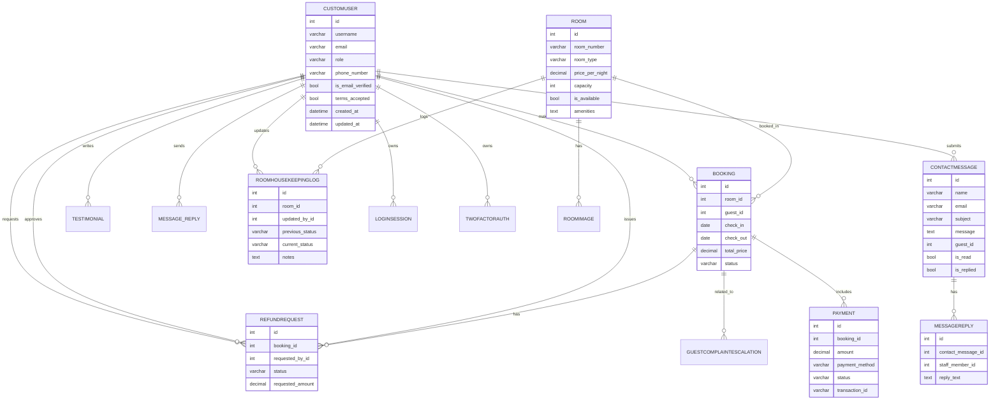

# Cebu Hotel System Design Overview

## 1. Level 0 — Context Diagram

The Cebu Hotel system is a web-based hotel management and guest services platform.

Actors:
- Guest
- Staff
- Manager
- Administrator
- External Payment Provider (Stripe / PayMongo / Maya / GCash)

System boundary:
- Cebu Hotel Hotel Management System

Primary interactions:
- Guest: register, log in, browse rooms, book a room, pay, submit contact messages, view testimonials, access guest services.
- Staff: manage bookings, update room status, reply to guest messages, escalate complaints, request refunds, approve services.
- Manager: review bookings, approve refunds, resolve escalations, manage staff.
- Administrator: manage users, rooms, payment configuration, audit logs, terms and conditions.
- Payment Provider: process transactions and refunds.

```
+--------------------+          +------------------------------+
|      GUEST         |          |   Payment Provider           |
+--------------------+          +------------------------------+
         |  browse rooms                 ^         ^
         |  book / pay                   |         |
         v                              |         |
+--------------------+                 |         |
|  Cebu Hotel System |<----------------+         |
|  (Booking / Rooms  |                           |
|   / Guest Services |                           |
|   / Payments / CRM)|                           |
+--------------------+                           |
    ^   ^   ^  ^                                |
    |   |   |  +------------------------------+
    |   |   |  |      External Services        |
    |   |   |  |   (Email, Notification, SMS) |
    |   |   |  +------------------------------+
    |   |   |
    |   |   +-------------------------+
    |   |                             |
+---+   +------------+        +-------+-------+
| STAFF | MANAGER   |        | ADMINISTRATOR |
+--------+----------+        +---------------+
```

## 2. Level 1 — Decomposed System Processes

The system can be decomposed into the following major processes:

1. Booking & Availability Management
   - Room catalog and availability check
   - Create and modify bookings
   - Calculate booking duration and total price
   - Manage booking status and cancellation policy

2. Payment & Refund Processing
   - Capture booking payments
   - Record payment status
   - Issue refunds and manage refund requests
   - Integrate with external payment gateways

3. Guest Services & Communication
   - Contact form submissions and staff replies
   - Guest complaint escalation workflow
   - Tracking guest inquiries and support status

4. Room Operations & Housekeeping
   - Room housekeeping logs
   - Room status updates (clean, dirty, maintenance)
   - Link housekeeping logs to room and booking events

5. Authentication & Authorization
   - Role-based access control (Guest, Staff, Manager, Admin)
   - 2FA / login session tracking
   - Terms and conditions acceptance management

6. Administration & Auditing
   - User, room, booking, and payment administration
   - Audit logs for critical actions
   - Content management for terms and conditions

## 3. Key Use Cases

| Actor | Use Case | Description |
|---|---|---|
| Guest | Register / Login | Create account, accept terms, log in with role-based access. |
| Guest | Browse rooms | View room catalog and availability. |
| Guest | Book room | Reserve a room for specified check-in and check-out dates. |
| Guest | Pay booking | Complete payment via external provider and record transaction. |
| Guest | Contact support | Submit contact messages and receive staff replies. |
| Staff | Manage bookings | View and update booking records, confirm or cancel bookings. |
| Staff | Update room status | Record housekeeping or maintenance status for rooms. |
| Staff | Reply to messages | Respond to guest contact messages and notify the guest. |
| Staff | Escalate complaints | Create escalation records and hand them to manager. |
| Manager | Approve refunds | Review refund requests and approve or reject them. |
| Manager | Resolve escalations | Manage complaint escalations and update status. |
| Admin | Manage users | Create, update, or delete users and assign roles. |
| Admin | Manage rooms | Configure room inventory, pricing, and availability. |
| Admin | Audit actions | Review audit logs and system events. |

### Example Use Case: Book Room
- Actor: Guest
- Precondition: Guest is authenticated and room is available.
- Basic flow:
  1. Guest selects room and dates.
  2. System checks availability using booking overlap rules.
  3. System calculates total price.
  4. Guest confirms booking.
  5. Booking record is created with status `PENDING`.
  6. Guest proceeds to payment.
- Postcondition: `Booking` record exists and payment is tracked.

### Example Use Case: Reply to Guest Message
- Actor: Staff
- Precondition: Guest message exists.
- Basic flow:
  1. Staff opens contact message.
  2. Staff enters reply text.
  3. System saves `MessageReply` and marks `ContactMessage.is_replied`.
  4. System optionally sends notification email to guest.
- Postcondition: guest message is marked replied and reply history is stored.

## 4. ERD (Entity Relationship Diagram)



## 5. System Architecture

### 5.1 Architecture Layers

- Presentation Layer
  - Django templates, forms, HTML pages, JavaScript handlers
  - Guest UI, staff dashboard, manager/admin views

- Application Layer
  - Django views and API endpoints
  - Form validation, booking logic, message handling, refund workflow

- Business Logic Layer
  - `Booking` availability and price calculation
  - `Payment` status handling
  - `ContactMessage` and reply processing
  - `RefundRequest` approval workflow

- Data Layer
  - Django ORM models: `CustomUser`, `Room`, `Booking`, `Payment`, `ContactMessage`, etc.
  - Database tables and relational constraints

- Integration Layer
  - External payment gateway integrations (Stripe, PayMongo, Maya, GCash)
  - Email notifications and service-triggered messaging

### 5.2 Component Overview

- Authentication & Authorization
  - `CustomUser` with role support
  - Login sessions, 2FA, terms acceptance

- Booking System
  - Room model with pricing and availability
  - Booking model with check-in/out, cancellation rules, and status

- Payments
  - Payment record linked to booking
  - Status tracking and external transaction IDs
  - Refund workflow through `RefundRequest`

- Guest Services
  - Contact forms and message threads
  - Staff replies and notification state
  - Complaint escalation from staff to manager

- Operations
  - Room housekeeping logs
  - Room status transitions and operational notes

### 5.3 Deployment & Runtime View

- Web server hosts Django application
- Database stores user, booking, payment, and support data
- Static templates and client-side JavaScript handle form interaction
- AJAX endpoints enable contact form submission and guest service updates
- Background services / staff actions update data and trigger notifications

## 6. Notes

- The system model is based on the project’s Django `authentication/models.py` definitions.
- Use the Mermaid ERD block in compatible viewers or later convert it to a visual diagram.
- This overview is ready to use for documentation, reports, or design review.
